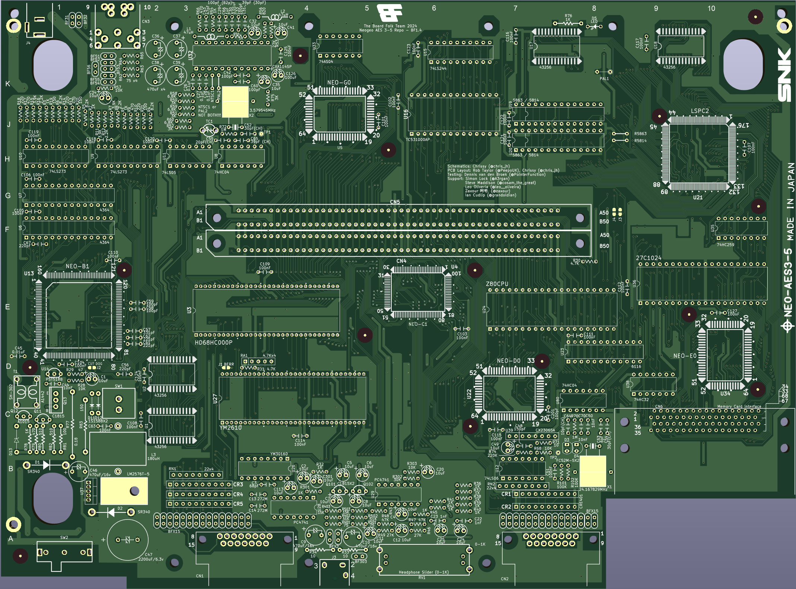

# NeoGeoAES-3.5 PCB Reproduction

This repository contains the recreation of main board PCB for NeoGeo AES
console. This recreation is based on the available schematics for the
NeoGeo AES and reverse engineering using scanned images of the original
boards' copper layers, so should be reasonably accurate reproductions.

## PCB Production

Minimum track widths, clearances and via sizes are within the standard
offering of modern PCB fabricators. Development was done using JLCPCB.

The design is verified to work as a 2-layer PCB.

## Bill of Materials

Most parts are marked on the board and it is expected that these will be reused
from a donor board. It is completely possible that your particular board uses
different (but compatible) parts so it's advisable to take photos before starting.
For a complete BOM, consult the KiCad projecs BOM folder, there you will find a csv file or a pdf.

[**PDF BOM**][BOM]

[**Interactive BOM**][IBOM]

## Thanks

  * Rob Taylor ([@PeepoUK](https://github.com/PeepoUK)) for doing most of
    the PCB layout.

  * Simon "Aergan" Lock ([@Aergan](https://github.com/Aergan))
    Cosam ([@cosam_the_great])
    Dennis (@PointerFunction)
    Leo Oliveria (@leo__oliveira)
    Zaxour 阿宅, (@zaxour)
    Ian Cudlip (@grandoldian) for their insights, support and
    testing of the prototype boards.

  * The rest of the Board Folk Team for their support and general
    coolness.

  * The NeoGeo Development Wiki (https://wiki.neogeodev.org/) for making
    the original NeoGeo-2 Schematics available, and the people who maintain
    this site.

## Legal

As the product of this project is a replica of a proprietary product, the
the author makes no claim of copyright to the schematics nor PCB layouts and
releases these into the public domain, solely for the purposes of study and
historical preservation.

You are free to produce PCBs based on this project's designs at your own risk
and without limitation, for your own use or for sale and/or repair at a
reasonable price. Attribution is appreciated. The authors are not obliged to
provide support of any kind.

Under no circumstances will the authors be held responsible or liable in any
way for losses, damages or costs resulting from the use of the information
and/or resources of this project.

The resources are provided "as-is" without warranty of any kind, either
expressed or implied, including, but not limited to, the implied warranties
of merchantability and fitness for a particular purpose.

[IBOM]: http://htmlpreview.github.io/?https://raw.githubusercontent.com/chris-jh/NeoGeoAES-3.5/main/bom/NeoGeo-AES-3_5.html

[BOM]: http://htmlpreview.github.io/?https://raw.githubusercontent.com/chris-jh/NeoGeoAES-3.5/main/bom/NeoGeoAES3_5-BOM
